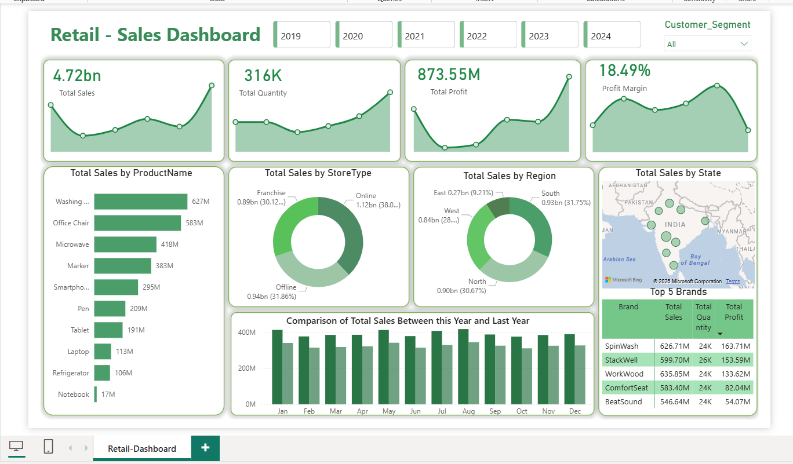

# 🛍️ Retail Sales Dashboard | Power BI

## 📌 Project Overview

This project is an interactive **Retail Sales Dashboard** built using **Power BI** to analyze sales performance, profitability, customer segments, product performance, regional sales, and store-wise trends. The dashboard provides business insights that help stakeholders monitor KPIs, identify high-performing products, compare yearly performance, and support data-driven decision-making.

---

## 🛠️ Tools & Technologies

- Power BI
- Power Query
- DAX
- Data Modeling
- Excel
- CSV
- Data Visualization

---

## 📊 Dashboard



---

## 📈 Analysis Performed

### Sales Performance
- Total Sales Analysis
- Total Quantity Sold
- Total Profit Analysis
- Profit Margin Monitoring
- Year-wise Sales Filtering

### Product Analysis
- Total Sales by Product
- Best-Selling Products
- Product Performance Ranking

### Store Analysis
- Sales Distribution by Store Type
- Online vs Offline Store Performance
- Franchise Performance

### Regional Analysis
- Sales by Region
- Sales by State (Map Visualization)
- Regional Contribution Comparison

### Time-Series Analysis
- Monthly Sales Comparison
- Current Year vs Previous Year Sales
- Monthly Sales Trend Analysis

### Brand Analysis
- Top 5 Brands by Sales
- Brand-wise Quantity Sold
- Brand-wise Profit Contribution

### Interactive Features
- Year Filter (2019–2024)
- Customer Segment Filter
- Dynamic KPI Cards
- Interactive Charts & Visualizations

---

## 📊 Key Performance Indicators (KPIs)

- Total Sales
- Total Quantity
- Total Profit
- Profit Margin
- Sales by Product
- Sales by Store Type
- Sales by Region
- Sales by State
- Top 5 Brands
- Monthly Sales Comparison

---

## 💡 Key Insights

- Total sales reached **4.72 Billion** with an overall **18.49% profit margin**.
- Washing Machines and Office Chairs generated the highest sales among all products.
- Online stores contributed the largest share of total sales compared to Franchise and Offline stores.
- The South region recorded the highest sales contribution.
- Monthly sales remained consistent, with stronger performance during the later months of the year.
- Leading brands generated significant revenue while maintaining healthy profit margins.
- Customer segmentation enables businesses to analyze purchasing behavior across different customer groups.

---

## 📌 Business Recommendations

- Increase inventory and marketing efforts for top-performing products to maximize revenue.
- Focus promotional campaigns on lower-performing products to improve sales.
- Expand successful online sales strategies to reach more customers.
- Invest in regions with high growth potential while maintaining strong performance in top-performing regions.
- Monitor monthly sales trends to optimize inventory planning and promotional activities.
- Strengthen partnerships with top-performing brands while identifying opportunities for emerging brands.

---

## 🎯 Skills Demonstrated

- Data Cleaning
- Data Modeling
- DAX Measures
- Power Query
- KPI Development
- Dashboard Design
- Business Intelligence
- Sales Analytics
- Data Visualization
- Business Insights
- Interactive Reporting

---

## 📂 Repository Structure

```
📁 Retail-Sales-Dashboard
│
├── README.md
├── Retail_Sales.pbix
├── Dashboard(2).png
├── Sales.csv
├── Product.csv
├── Customer.xlsx
├── Store.xlsx
└── LICENSE
```

---

## 🎯 Project Objective

The objective of this project was to build an interactive retail sales dashboard that enables businesses to monitor sales performance, evaluate product and regional trends, analyze customer segments, and support strategic decision-making through data visualization.

---

## 👨‍💻 Author

**Mehul Gojiya**

Aspiring Data Analyst | SQL | Power BI | Python | Excel

⭐ If you found this project useful, consider giving the repository a star!
